# cve_bot
Retrieval-Augmented Generation (RAG) agent designed to investigate Common Vulnerabilities and Exposures (CVE) notices. The tool is specifically tailored to assist users in determining whether their current application or system setups are susceptible to identified exploits. By integrating question-answering capabilities with focused CVE research, the RAG agent provides clear, context-specific insights into vulnerability exposure based on user inquiries.

```mermaid
flowchart LR
    UI --> |CVE and Question| R((Fetch Pages))    
    R --> G((Grade docs))
    G --> RE{Relevance}
    RE --> |Yes|GA((Generate Answer))
    RE --> |No|W((Web Search))
    W --> GA
    GA --> H((🍄))
    H --> |Yes| GA
    H --> |No| A{Answers Question?}
    A --> |Yes| Answer
    A --> |No| W
```



# Example Output (so far...)
```terminal
# Number of docs with question relevance: 4
{'score': 'yes'}
# Answering question
# number of docs with question relevance:  4
The exploit is designed to perform a Sudo Privilege Escalation / Heap Overflow, leveraging CVE-2021-3156 vulnerability. It does so by:

* Creating directories and symbolic links (symlinks) as needed
* Executing forked processes to overflow the heap and potentially gain root privileges
* Compiling a malicious C program and uploading it to the target directory
* Overwriting sensitive files, such as /etc/passwd

The exploit provides options for setting the sleep time for forked processes and specifying alternative targets or source files.
```