```mermaid
flowchart LR
    UI --> |CVE and Question| R((Fetch Pages))    
    R --> G((Grade docs))
    G --> RE{Relevance}
    RE --> |Yes|GA((Generate Answer))
    RE --> |No|W((Web Search))
    W --> GA
    GA --> H((🍄))
    H --> |Yes| GA
    H --> |No| A{Answers Question?}
    A --> |Yes| Answer
    A --> |No| W
```

# cve_bot
Retriever-Augmented Generation (RAG) agent designed to investigate Common Vulnerabilities and Exposures (CVE) notices. The tool is specifically tailored to assist users in determining whether their current application or system setups are susceptible to identified exploits. By integrating question-answering capabilities with focused CVE research, the RAG agent provides clear, context-specific insights into vulnerability exposure based on user inquiries.

