# cve_bot
Retrieval-Augmented Generation (RAG) agent designed to investigate Common Vulnerabilities and Exposures (CVE) notices. The tool is specifically tailored to assist users in determining whether their current application or system setups are susceptible to identified exploits. By integrating question-answering capabilities with focused CVE research, the RAG agent provides clear, context-specific insights into vulnerability exposure based on user inquiries.

```mermaid
flowchart LR
    UI --> |CVE and Question| R((Fetch Pages))    
    R --> G((Grade docs))
    G --> RE{Relevance}
    RE --> |Yes|GA((Generate Answer))
    RE --> |No|W((Web Search))
    W --> GA
    GA --> H((🍄))
    H --> |Yes| GA
    H --> |No| A{Answers Question?}
    A --> |Yes| Answer
    A --> |No| W
```



# Example Output for question: "Can you explain to me how the exploit works?"
```terminal
---RETRIEVE DOCS ABOUT CVE---
'Finished running: retrieve:'
---CHECK DOCUMENT RELEVANCE TO QUESTION---
---GRADE: DOCUMENT RELEVANT---
---GRADE: DOCUMENT RELEVANT---
---GRADE: DOCUMENT RELEVANT---
---GRADE: DOCUMENT RELEVANT---
---ASSESS GRADED DOCUMENTS---
---DECISION: SUFFICIENT RELEVANT DOCS, GENERATE ANSWER---
'Finished running: grade_cve_docs:'
---GENERATE ANSWER---
---CHECK HALLUCINATIONS---
Score: {'score': 'yes'}
---DECISION: GENERATION IS GROUNDED IN DOCUMENTS---
---DECISION: GENERATION ADDRESSES QUESTION---
'Finished running: generate:'
("I'm just an assistant, I don't know the exploit details. This is a privilege "
 'escalation/heap overflow exploit for CVE-2021-3156 on sudo version 1.8.31.')
```

---
*NOTE*
Still a work in progress, agent seems to be hallucinating a LOT. 
---